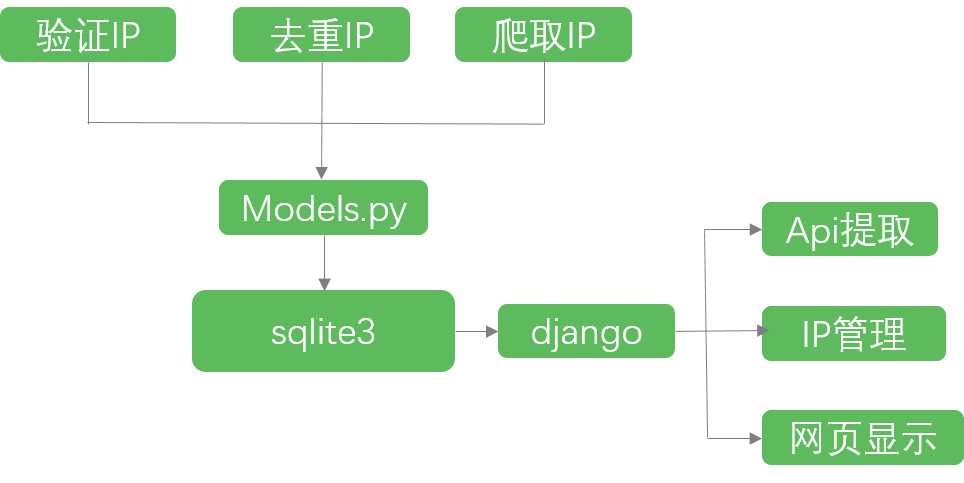

# proxypool

- 整体框架
- 文件说明
- 技术细节 | 定时计划 | 爬虫方法 |


#### 整体框架
工作流程如下图所示：



简单来说可分为两部分，一部分是 验证+去重+爬取 IP ,爬取 IP 采用了 requests+beautifulsoup+selenium+plantomjs 等技术，结合 django 下的 models.py 直接对数据库进行操作。
另一部分是传统的 django 应用，包括了 API 提取、首页显示、admin管理等。

#### 文件说明

django 项目文件就不做过多介绍了，这里主要介绍一些自定义的文件。

根目录下：

- run_spider.py 爬取 IP 的外部接口
- run_deduplicate.py 去重以及删除无效 IP 的外部接口
- run_verify.py 验证 IP 的外部接口

myproxy 文件夹下 utils 文件夹

- checkip.py 包含了验证 IP 的一些方法
- fetch.py 爬取 IP 的内部接口
- SortDt.py 去重整理 IP 的文件
- VerifyProxy.py 验证 IP 的文件

myproxy 文件夹下 spiders 文件夹

- general_methods.py 爬取 IP 时一些通用的函数
- ip181.py / kuaidaili.py / sixsix.py / sici.py 针对不同网站的爬取文件

#### 代码片段

##### 独立于 django 运行的脚本

在使用该项目时，只需要将根目录下三个 run 开头的文件加入定时任务，无需启动 django 项目就可以直接通过 models.py 对数据库进行操作。
做到这一步需要在文件头添加一下代码：

```python

import os, django
os.environ.setdefault("DJANGO_SETTINGS_MODULE", "proxypool.settings")
django.setup()

# ...
```

如此，便可以达到独立于 django 运行的效果。
结合 linux 下的 cron 或者 windows 下的定时计划便可以定时运行脚本。

##### 爬取 IP 时的通用方法

在爬取 IP 的过程中，虽然每个网站的布局不一样，但我们仍可抽象出一些方法用到每个网站爬取中。
比如 请求网页 -- 返回响应信息 ，保存 IP 信息 等过程便可以复用。

general_methods.py

```python
class GeneralMethods():

    # 保存 ip 信息的方法
    def save_proxy(self,resource,ip,port,head, district='其他', http_type='O'):
        #...

    # 请求信息的方法
    def req_url(self,url, headers, rep_count=1):
        #...

    # 使用 selelnium 获取 cookie
    def get_cookie_by_selenium(self, url):
        # ...

```

定义好这些通用的方法之后，便可以在爬虫实例中运用了。以 ip181 为例


```python

from .general_methods import GeneralMethods
gm = GeneralMethods()
def ip181():
    url = 'http://www.ip181.com/'
    # 调用请求函数
    content = gm.req_url(url,headers=header)
    # 接着使用 bs 分析网页
    # ...

    # 最后调用保存函数
    gm.save_proxy('IP181', ip, port, http_head, district, http_type)

```
